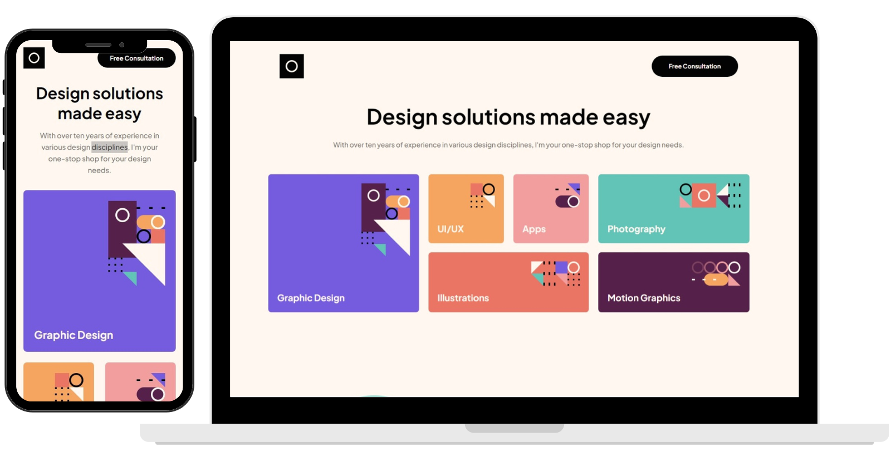

# Welcome to Single Page Portfolio!

## About this proyect

It is a challenge proyect supplied by <a href="https://www.frontendmentor.io/profile/SantiNakc">Frontend Mentor</a>

## How I made it

- I used pure CSS and vanilla JS
- I tried to make it the fastest and cleaner i can
- I made it responsive, like every page or web aplication i make

It was an easy layout to practice some grid and flex, It took a little bit of js to make the carrousel.

